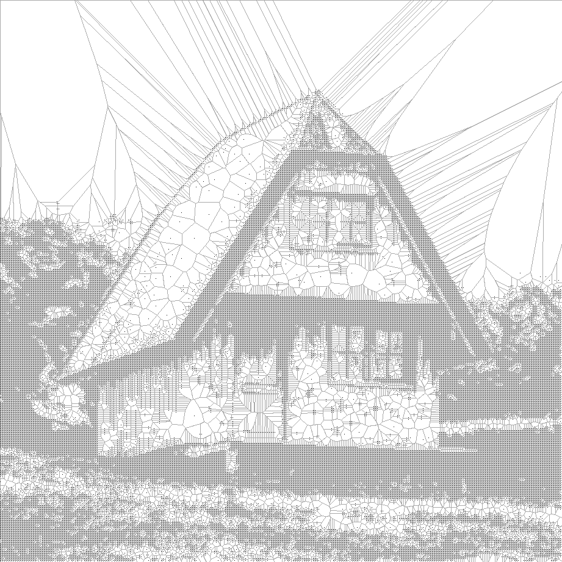
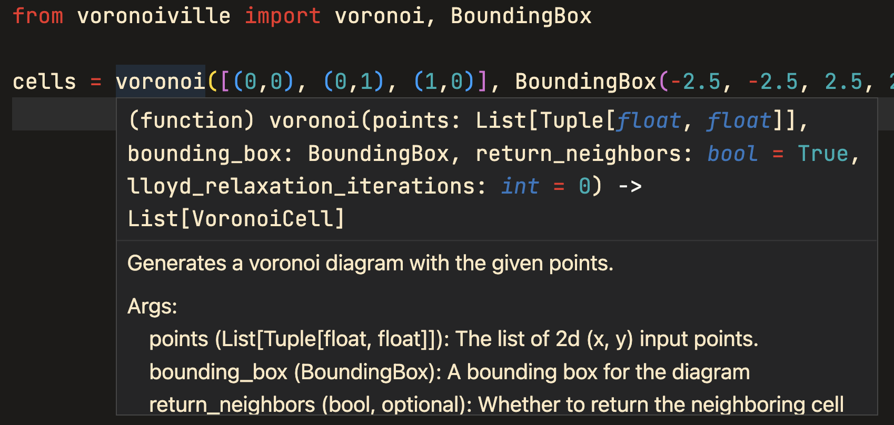

# Voronoiville

[](https://pypi.python.org/pypi/voronoiville)
[](https://github.com/pmbaumgartner/voronoiville/blob/main/LICENSE)


Fast Voronoi diagrams in Python written in Rust, thanks to the [`voronoice`](https://crates.io/crates/voronoice) crate, [`PyO3`](https://pyo3.rs/), and [`maturin`](https://maturin.rs/).

## Example Use

```python
from voronoiville import voronoi, BoundingBox

cells = voronoi([(0,0), (0,1), (1,0)], BoundingBox(-2.5, -2.5, 2.5, 2.5))
first_cell = cells[0]

first_cell.position
# (0.0, 0.0)

first_cell.site
# 0

first_cell.vertices
# [(0.5, 0.5), (0.5, -2.5), (-2.5, -2.5), (-2.5, 0.5)]

first_cell.neighbors
# [2, 1]

# All cells are on the hull (touch the bounding box)
assert all(cell.is_on_hull for cell in cells)
```

## Install

```
pip install voronoiville
```

dev:

```
pip install git+https://github.com/pmbaumgartner/voronoiville
```

## Motivation & Comparison

The main tool I've used for Voronoi diagrams is [`scipy.spatial.Voronoi`](https://docs.scipy.org/doc/scipy/reference/generated/scipy.spatial.Voronoi.html), which uses [Qhull](http://www.qhull.org/). There were three primary shortcomings with this implementation for my use: (1) I didn't want to include all of scipy as a dependency just to draw Voronoi diagrams; (2) it doesn't support bounding boxes, which forced me to resort to weird hacks or verbose code to fit diagrams within boxes; (3) it returns a matrix you have to index to get the vertices, thus requires some additional code to get things like the corresponding polygons or neighboring cells.

There are notebooks comparing & visually testing against `scipy.spatial.Voronoi` in the `extra` folder. 

On average, `voronoiville.voronoi` is ~4x faster than `scipy.spatial.Voronoi`. It's also ~2-4x faster than `shapely.ops.voronoi_diagram`. You can get further speedups to about ~5x faster by passing `return_neighbors=False` to `voronoi`, which prevents iterating and collecting each cells neighbors. There is more info available in `extra/bechmark.ipynb`.

**Type Hints & Docstrings**

Everything should be type annotated and have docstrings, so you can autocomplete/Intellisense.



**Other Stuff**

Resources:
- Lloyd relaxation algorithm visual: https://douglasduhaime.com/posts/lloyd-iteration.html

**A looping GIF of Lloyd's relaxation algorithm**

